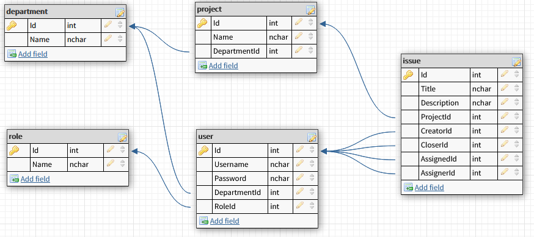

# IssueTrackerNotes

The purpose of this repository is only to explain with greater detail the assumptions I took while developing [IssueTracker](rb-issuetracker.azurewebsites.net), my personal project.

My goal with the project is to explore the concepts of web development using ASP.NET Core, for that reason, there may be considerations with one may agree while others may not. I would be happy if I ever got any kind of advice or feedback.

I aimed for a simple functionality that would allow me to release the project, there are several mechanims that are thought but not implemented, such as the distinction between basic and moderator users or the creation of new projects for each department. There are other small details that I’m planning to change such as the actual database schema, I would like to improve it. 

IssueTracker is a work in progress and I do not really know where it will lead, but I think it has been serving its purpose exceptionally well by allowing me to explore the web development world whenever I have the time.

Bellow, one will find the reasoning behind each of the assumptions and decisions that I considered throughout the development of IssueTracker

### - I used Git Bash exclusively to perform all my Git operations

Ever since I started to develop software, I always had my git operations simplified through the usage of a GUI such as GitKraken or GitFork. The more I learned, the more it became clear to me why using GitBash is more appropriate, especially when working with anything similar to an EC2 instance or a docker container. Thus, I adopted GitBash as my only option available.

### - I used an SQL Server database

The functionality expected from IssueTracker screams for RDBMS, issues associated with a specific project created by a user and assigned to any other each belonging to a department. Everything is related and it is desired to be that way, so it would only make sense to use a SQL database instead of a NoSQL solution.

### - The database schema was designed and implemented by me

Everything about IssueTracker, for the good and the bad, was designed by me. The database schema was no exception and it is presented by the following image:

  

I tried to not overcomplicate things and allowed for columns such as `CloserId` or `AssignedId` to assume null values. This saved me to have an additional table that would describe what could be seen as an `action` towards each issue, e.g. *user `x` closed issue `y`*, a convenient approach that would allow to log each user operation. Another aspect to note is the lack of timestamps throughout the whole schema, yet another simplification considered. These are some of the improvements that I am considering for the future regarding the database schema, as mentioned in the introductory paragraphs of the present documentation.

### - I prepared a set of queries to perform all the initial setup of the database

I thought about IssueTracker as a product that should be easy and fast to implement in any scenario or context, whether the DB is on a local machine, a docker container or a web service such as Azure. By making use of a single initial setup file, all I needed was to execute the file one time to ensure that the DB is ready to connect to the IssueTracker app. A convenient mechanism when creating multiple docker container instances for example.

### - I did not use ORMs, I adopted DAOs instead

Up to this day, I never really had the opportunity to develop according to the demands of a DBA. Additionally, I have not yet found the time to explore EF with detail, frameworks tend to be complex. Nonetheless, I am aware that ORMs such as EF tend to automatize DB operations that often conflict with requirements or demands imposed by DBAs which could jeopardize production. Considering this information, I decided to implement DAOs instead of using ORMs in the hope that DBAs would be pleased with such decision and that I would force myself to a lower level of abstraction when performing DB operations.

### - I ensured that my database objects were instantiated through DI

I believe that the advantages of DI become quite clear when a DB is in play. Swapping production DBs with test DBs is as simple as changing the object type associated to the corresponding DB interface, without having to change any other line of code throughout the app.

### - The pagination mechanism was fully implemented by me

As mentioned previously, I am using DAOs. This means that I am not using a framework such as EF that would allow me to abstract some DB operations. The pagination and results per page mechanisms were fully implemented by me. What I mean with this is that I am **not** fetching all the results from the DB and filtering what I have in memory to be presented, I am instead computing the necessary offsets so that I only extract the information that I want to show from the DB. I tried, whenever I could, to minimize the DB operations and effort because I am aware of how much it could cost when using a web service such as Azure or AWS.

### - The login feature is also implemented by me, through attributes and session variables

I am aware that one should avoid storing user passwords at all costs, leaving such sensitive task to companies like Google or Microsoft. Since the goal of IssueTracker is self-learning, I wanted to put the case where I did not have access to such tools, in fact, and once again, not even to EF or any other similar mechanisms. This forced me to research concerns that quickly rose as I was developing such as:

- *Am I allowed to store information on client side? If so, what type of information?*
- *What is the proper way to store sensitive information? (assuming that I really need to do so)*
- *How can I persist a user login?*
- *How and when should I validate the user login?*
- *How extensive is the information access of each client?*

Regarding the user login management, I am using session variables and C# Attributes to validate such logins, namely `IAuthorizationFilter` a convenient `AspNet MVC` mechanism. 

### - All sensitive data is properly encoded before being stored in the database

The previous point explains the reason why I am storing sensitive data. For IssueTracker I am using the bcrypt hashing algorithm before storing/validating each user password. The operation is done at server side.
